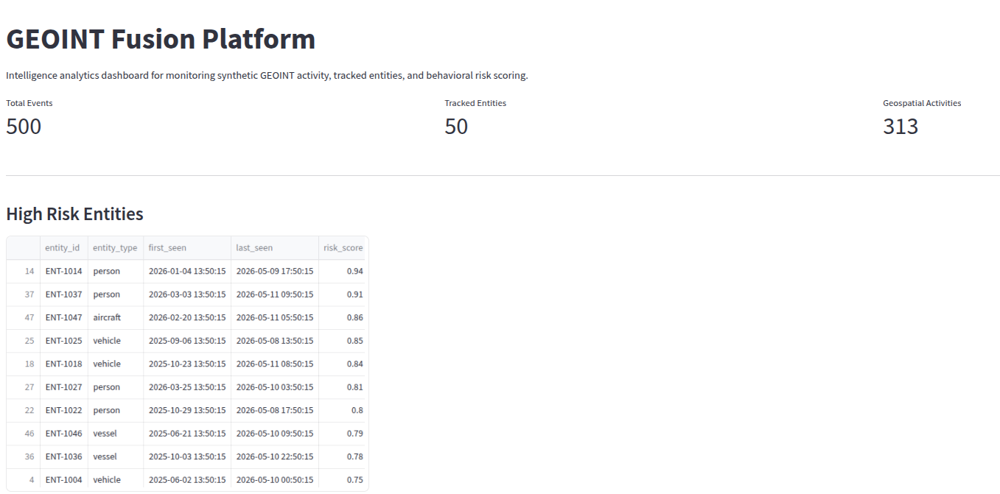

# GEOINT Fusion Platform

An end-to-end intelligence analytics and data engineering platform built with Python, PostgreSQL, Docker, and SQL-based analytics workflows.


The platform simulates an intelligence fusion environment for tracking
high-risk entities, correlating geospatial activity, and generating
behavior-based analytical insights from streaming event data.

---

# Architecture

```text
Synthetic Intelligence Generators
                ↓
        Python ETL Pipelines
                ↓
      PostgreSQL Data Warehouse
                ↓
        SQL Analytics Layer
                ↓
     Entity Risk Scoring Engine
                ↓
   Future Dashboard / API Layer
```

---

# Features

## Data Engineering

- Python-based ETL pipelines
- PostgreSQL warehouse modeling
- Dockerized infrastructure
- Environment-variable configuration
- Modular package-based architecture
- Synthetic intelligence event generation

## Intelligence Analytics

- GEOINT-style event simulation
- Persistent entity tracking
- Geospatial activity modeling
- Event correlation analysis
- Behavioral risk scoring
- Multi-table warehouse analytics

## Platform Engineering

- Dockerized PostgreSQL deployment
- SQLAlchemy database connectivity
- Package-oriented Python structure
- Git/GitHub workflow integration
- Analytics-ready relational schema

---

# Tech Stack

| Category | Technologies |
|---|--------------|
| Language | Python 3.8   |
| Database | PostgreSQL   |
| Infrastructure | Docker       |
| ORM / Connectivity | SQLAlchemy   |
| Data Processing | Pandas       |
| Synthetic Data | Faker        |
| Analytics | SQL + Python |
| IDE | PyCharm      |
| Version Control | Git + GitHub |

---

# Current Project Structure

```text
geoint-fusion-platform/
│
├── analytics/
│   └── risk_scoring.py
│
├── ingestion/
│   ├── __init__.py
│   ├── entity_simulator.py
│   ├── load_entities.py
│   ├── load_intel_events.py
│   └── synthetic_data_generator.py
│
├── warehouse/
│   ├── __init__.py
│   ├── db_connection.py
│   └── schema.sql
│
├── tests/
├── data/
├── docs/
│
├── docker-compose.yml
├── requirements.txt
├── .env
├── .gitignore
└── README.md
```

---

# Data Warehouse Schema

## intel_events

Stores synthetic intelligence event streams.

### Example fields

- event_time
- event_type
- entity_id
- latitude
- longitude
- source_system
- confidence_score

---

## tracked_entities

Stores persistent tracked entities used for intelligence analysis.

### Example fields

- entity_id
- entity_type
- first_seen
- last_seen
- risk_score

---

## geospatial_activity

Stores regional geospatial activity associated with tracked entities.

### Example fields

- entity_id
- region
- activity_level
- timestamp

---

# Example Analytics

## Top Risk Entities

```sql
SELECT
    t.entity_id,
    t.entity_type,
    t.risk_score,
    COUNT(i.event_id) AS event_count,
    AVG(i.confidence_score) AS avg_confidence
FROM tracked_entities t
JOIN intel_events i
    ON t.entity_id = i.entity_id
GROUP BY
    t.entity_id,
    t.entity_type,
    t.risk_score
ORDER BY
    t.risk_score DESC,
    event_count DESC;
```

---

# Local Setup

## 1. Clone Repository

```bash
git clone https://github.com/YOUR_USERNAME/geoint-fusion-platform.git
cd geoint-fusion-platform
```

---

## 2. Create Virtual Environment

```bash
python -m venv venv
```

Activate:

### Linux/macOS

```bash
source venv/bin/activate
```

### Windows

```powershell
venv\Scripts\activate
```

---

## 3. Install Dependencies

```bash
pip install -r requirements.txt
```

---

## 4. Configure Environment Variables

Create:

```text
.env
```

Example:

```env
DB_HOST=localhost
DB_PORT=5433
DB_NAME=geoint_db
DB_USER=geoint_user
DB_PASSWORD=geoint_pass
```

---

# Docker Setup

## Start PostgreSQL Container

```bash
docker compose up -d
```

Verify:

```bash
docker ps
```

Expected:

```text
geoint_postgres
```

---

# Database Initialization

Run schema creation:

```bash
psql -h localhost -p 5433 -U geoint_user -d geoint_db -f warehouse/schema.sql
```

---

# Running the Pipelines

## Generate and Load Intelligence Events

```bash
python -m ingestion.load_intel_events
```

---

## Generate and Load Entities + Geospatial Activity

```bash
python -m ingestion.load_entities
```

---

# Run Analytics Layer

## Risk Scoring Engine

```bash
python -m analytics.risk_scoring
```

This computes behavioral risk scores using:

- event frequency
- confidence weighting
- aggregated entity activity

---

# Example Output

```text
Top Risk Entities:

entity_id   risk_score   event_count
ENT-1014        0.87            42
ENT-1031        0.82            37
ENT-1007        0.81            35
```

---
# Dashboard Preview



The Streamlit dashboard provides:

- real-time warehouse analytics
- tracked entity monitoring
- intelligence event distributions
- behavioral risk scoring insights
- geospatial activity summaries

# Engineering Concepts Demonstrated

## Data Engineering

- ETL pipeline design
- Relational warehouse modeling
- Synthetic data generation
- SQL-based analytics
- Environment isolation
- Dockerized infrastructure
- Python package architecture

## Analytics Engineering

- Multi-table analytical queries
- Entity-event correlation
- Aggregation pipelines
- Risk scoring models
- Analytical feature computation

## Platform Engineering

- Modular project structure
- Infrastructure reproducibility
- Containerized services
- Git-based workflow management

---

# Planned Enhancements

- Apache Airflow orchestration
- PySpark distributed processing
- Streamlit intelligence dashboard
- Geospatial heatmaps
- dbt transformation layer
- Great Expectations data quality checks
- FastAPI service layer
- Machine learning anomaly detection
- Entity resolution workflows
- Automated CI/CD pipelines

---


# License

MIT License
